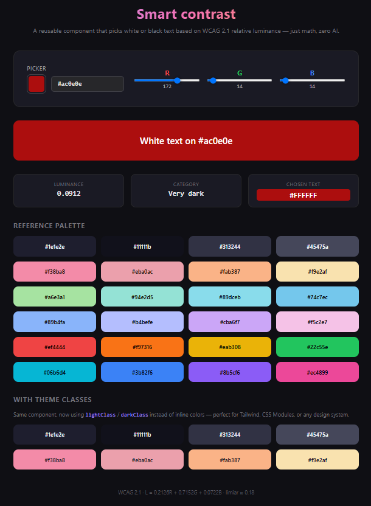

<p align="center">
  <picture>
    <source media="(prefers-color-scheme: dark)" srcset="https://img.shields.io/badge/WCAG-2.1_AAA-8b5cf6?style=for-the-badge&logo=w3c&logoColor=white&labelColor=1e1e2e">
    
  </picture>
  &nbsp;
  
  &nbsp;
  
  &nbsp;
  
</p>

<br>

<h1 align="center">🎨 ContrastText</h1>

<p align="center">
  <strong>The React component that never gets text color wrong.</strong><br>
  Black or white? Let the <em>physics of human perception</em> decide.
</p>

<br>

<p align="center">
  
</p>

<br>

---

## 🤔 The problem

You're building a badge. A card. An avatar with colored initials. The background is dynamic — it comes from a database, a hash, or user input. Now what? **What color should the text be?**

| Approach                     | What happens                                                                  |
| ---------------------------- | ----------------------------------------------------------------------------- |
| `color: white` hardcoded     | 🪦 Unreadable on light backgrounds                                            |
| `color: black` hardcoded     | 🪦 Unreadable on dark backgrounds                                             |
| `mix-blend-mode: difference` | 🫠 Works… sometimes. Fails on mid-tones and won't pass an accessibility audit |
| **`<ContrastText>`**         | ✅ Always legible. Always WCAG AAA. Zero effort.                              |

---

## ✨ The solution

```tsx
import { ContrastText } from "contrast-text";

<ContrastText bgColor="#8b5cf6">
  Purple Haze
</ContrastText>

<ContrastText bgColor="rgb(255, 200, 50)">
  Golden Hour
</ContrastText>
```

The component computes **relative luminance** using the **WCAG 2.1** formula — the same algorithm governments and major products rely on for accessibility certification — and picks whichever of black or white yields the **higher contrast ratio**.

Pure math — no AI required.

---

## 🧪 The math (in 3 lines)

$$L = 0.2126 \cdot R_{\gamma} + 0.7152 \cdot G_{\gamma} + 0.0722 \cdot B_{\gamma}$$

$$\text{contrast ratio} = \frac{L_{\text{lighter}} + 0.05}{L_{\text{darker}} + 0.05}$$

> The human eye is most sensitive to green. The formula weights the channels accordingly. The result **feels right** — because it's based on how we actually see.

---

## 🚀 Installation

```bash
npm install contrast-text
```

> ⚠️ _Not yet published to npm. For now, clone or copy `src/components/ContrastText.tsx` and `src/utils/colorContrast.ts` into your project._

---

## 📦 API

### `<ContrastText>`

| Prop         | Type            | Required | Description                                                         |
| ------------ | --------------- | -------- | ------------------------------------------------------------------- |
| `bgColor`    | `string`        | ✅       | Background color in hex (`#ff0000`, `ff0000`) or `rgb(r,g,b)`       |
| `children`   | `ReactNode`     | —        | Content to render. Falls back to displaying `bgColor`               |
| `style`      | `CSSProperties` | —        | Extra inline styles on the wrapper                                  |
| `className`  | `string`        | —        | Extra CSS class on the wrapper                                      |
| `lightClass` | `string`        | —        | CSS class for light text on dark backgrounds. Requires `darkClass`  |
| `darkClass`  | `string`        | —        | CSS class for dark text on light backgrounds. Requires `lightClass` |

### Theming with CSS classes

When both `lightClass` **and** `darkClass` are provided, the component **does not inject** an inline `color`. Instead it applies the matching class — perfect for Tailwind, CSS Modules, styled-components, or any design system:

```tsx
// Tailwind ✌️
<ContrastText
  bgColor="#1e1e2e"
  lightClass="text-white"
  darkClass="text-gray-900"
/>

// CSS Modules
<ContrastText
  bgColor="#fab387"
  lightClass={styles.onDark}
  darkClass={styles.onLight}
/>
```

### Exported utility functions

```ts
import {
  contrastForeground, // (r,g,b) → "#FFFFFF" | "#000000"
  needsLightForeground, // (r,g,b) → boolean
  relativeLuminance, // (r,g,b) → number (0–1)
  luminanceLabel, // (lum) → "Very dark" | ... | "Very light"
  parseColor, // "hex|rgb" → {r,g,b} | null
  contrastRatio, // (lum1, lum2) → number (1–21)
} from "contrast-text";
```

---

## 🎮 Interactive demo

Run it locally:

```bash
git clone https://github.com/helen/contrast-text.git
cd contrast-text
npm install
npm run dev
```

The demo includes:

- 🎨 **Native color picker** + real-time RGB sliders
- 📊 **Stats panel**: luminance, category, chosen foreground
- 🏷️ **24-color grid** showing the component in action
- 🧵 **Theme-class section** (real-world Tailwind-like usage)

---

## 📐 Conformance

| WCAG 2.1 criterion                | Met?                              |
| --------------------------------- | --------------------------------- |
| 1.4.3 — Contrast (Minimum) (AA)   | ✅ Ratio ≥ 4.5:1 for normal text  |
| 1.4.6 — Contrast (Enhanced) (AAA) | ✅ Ratio ≥ 7:1 for normal text    |
| Deterministic & auditable         | ✅ Pure function, zero randomness |

---

## 🏗️ Project stack

- **React 19** + **TypeScript 6.0**
- **Vite 8** (dev server + bundler)
- **Zero external dependencies** — the component imports only React

---

## 📄 License

MIT © 2026 Jardel Simão

---
